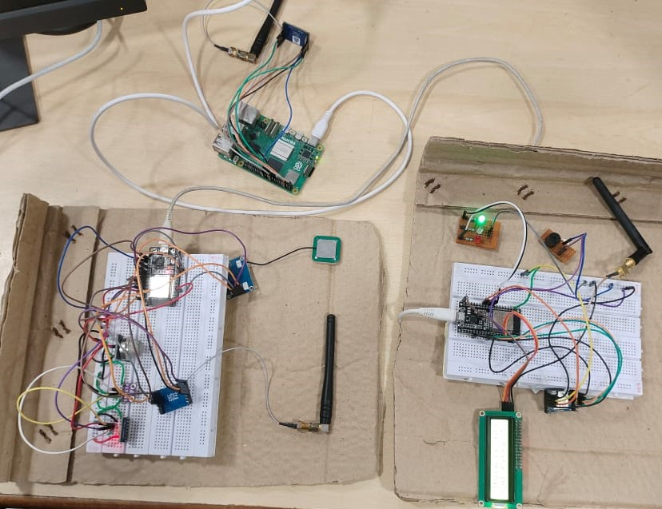
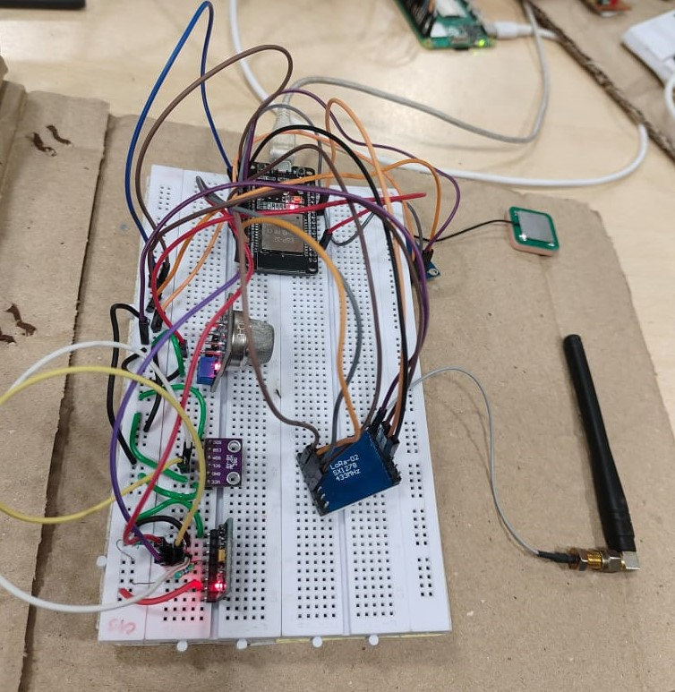
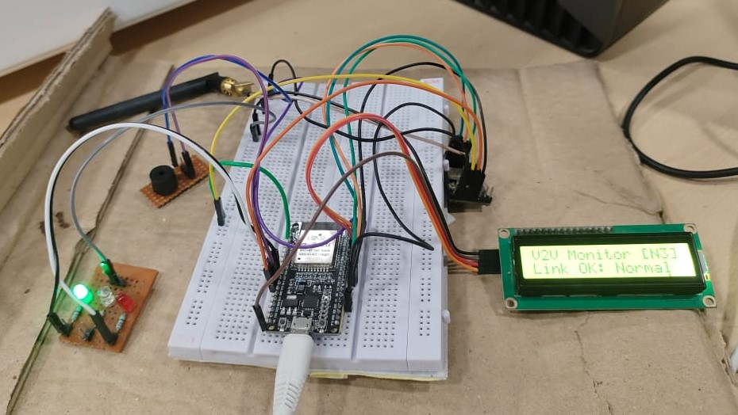
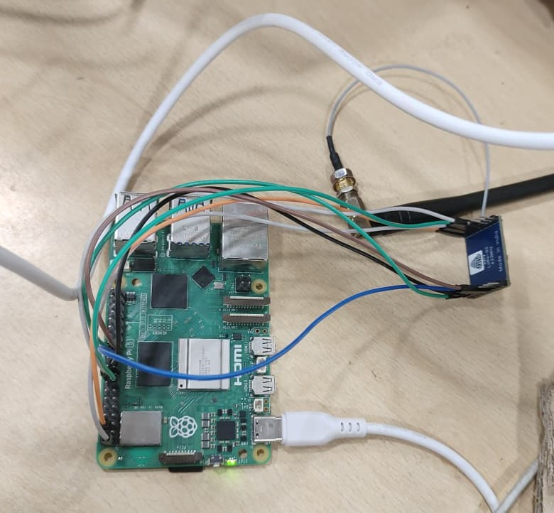
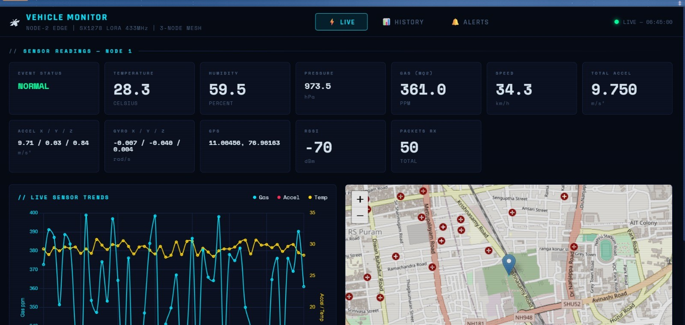

# 🚗 Vehicle Fall & Crash Detection System

A real-time **IoT-based Vehicle Fall & Crash Detection System** developed using **ESP32, Raspberry Pi, LoRa, and Flask**. The system detects vehicle accidents, tracks GPS location, sends emergency alerts, and provides live monitoring through a web dashboard.

---


# 📌 Project Overview

This project continuously monitors vehicle conditions using multiple sensors connected to an ESP32. The collected data is transmitted through **LoRa** to a **Raspberry Pi**, where it is processed, stored, and displayed on a **Flask dashboard**.

If an accident or abnormal condition is detected, the system:

- Detects crash and vehicle fall
- Tracks GPS location
- Sends emergency email alerts
- Displays alerts on the dashboard
- Notifies nearby vehicles using LoRa (V2V)

---

# ✨ Features

- 🚨 Real-Time Crash Detection
- 🚗 Vehicle Fall Detection
- 📡 Long-Range LoRa Communication
- 🌍 GPS Tracking
- ⚡ Raspberry Pi Edge Computing
- 📊 Flask Web Dashboard
- 📧 Email Alert System
- 🔒 XOR Encryption
- ✅ CRC Packet Validation
- 🗄 SQLite Database
- 🚘 Vehicle-to-Vehicle (V2V) Alerts

---

# 🛠 Hardware Components

- ESP32 Development Board
- Raspberry Pi
- SX1278 LoRa Module
- MPU6050 Accelerometer & Gyroscope
- MQ135 Gas Sensor
- BME280 Sensor
- NEO-6M GPS Module
- LCD Display
- Jumper Wires
- Power Supply

---

# 💻 Software Used

- Embedded C
- Python
- Flask
- SQLite
- HTML & CSS
- LoRa Communication
- Raspberry Pi OS
- ZeroTier

---

# ⚙️ System Workflow

```text
Sensors
   │
   ▼
ESP32 Sender
   │
   ▼
LoRa Communication
   │
   ▼
Raspberry Pi Edge Server
   │
   ├── SQLite Database
   ├── Flask Dashboard
   ├── Email Alerts
   └── V2V Alerts
```

---

## 📷 Project Images

### 🔹 Complete Hardware Setup

<p align="center">
  
</p>

---

### 🔹 ESP32 Sender Node

<p align="center">
  
</p>

---

### 🔹 ESP32 Receiver Node

<p align="center">
  
</p>

---

### 🔹 Raspberry Pi Edge Server

<p align="center">
  
</p>

---

### 🔹 Flask Dashboard

<p align="center">
  
</p>

---

# 📂 Project Structure

```text
Vehicle-Fall-Crash-Detection-System
│
├── EDGE_SERVER (node2)
├── ESP32 SENDER (node1)
├── ESP32_RECEIVER (node3)
│
├── image1.jpeg   (Sender Node)
├── image2.jpeg   (Complete Setup)
├── image3.jpeg   (Receiver Node)
├── image4.jpeg   (Edge Server)
├── image5.jpeg   (Dashboard)
│
└── README.md
```

---

# 📈 Results

- ✔ Real-Time Accident Detection
- ✔ Reliable LoRa Communication
- ✔ Live Dashboard Monitoring
- ✔ GPS Location Tracking
- ✔ Emergency Email Alerts
- ✔ Vehicle-to-Vehicle Communication

---

# 🎯 Applications

- Smart Vehicle Safety
- Fleet Monitoring
- Emergency Response
- Connected Vehicles
- IoT Automotive Systems

---

# 📚 Skills Demonstrated

- Embedded Systems
- ESP32 Programming
- Raspberry Pi
- LoRa Communication
- Sensor Interfacing
- Flask Development
- Edge Computing
- SQLite Database
- GPS Integration

---

# 👨‍💻 Author

**Naveen Kumar S**

**M.Tech – Embedded Systems Engineering**

**Amrita Vishwa Vidyapeetham**

---
